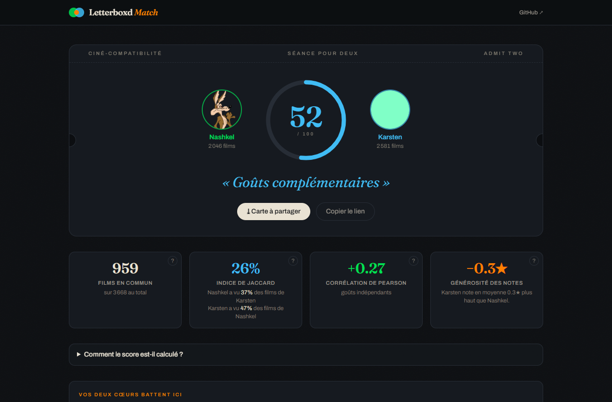
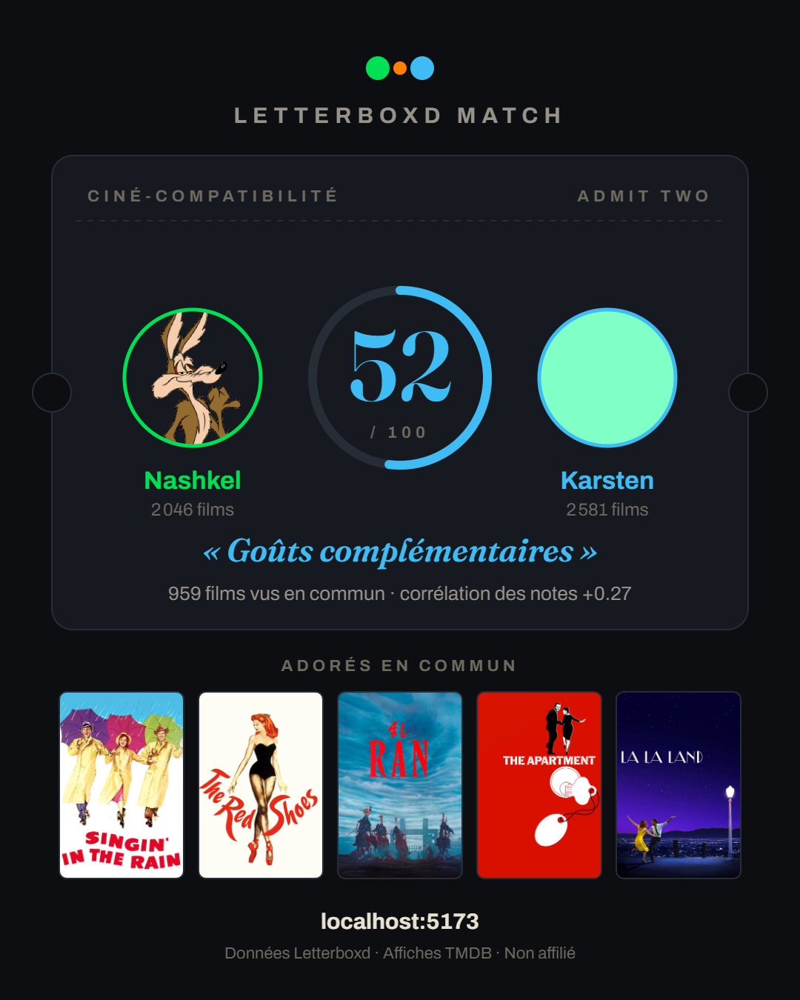

# Letterboxd Match

**Deux profils Letterboxd entrent, un score de compatibilité cinéphile sort.**

[](https://github.com/alanvourch/letterboxd-match-app/actions/workflows/ci.yml)

🎬 **Démo live : [letterboxd-match.vercel.app](https://letterboxd-match.vercel.app)**



Tape deux pseudos Letterboxd publics (avec autocomplétion) — ou dépose un export
CSV pour rester 100 % local — et obtiens :

- un **score de compatibilité 0–100** avec verdict,
- vos **films adorés en commun** (avec affiches) et vos **films clivants**,
- l'**accord par genre**, vos **réalisateurs en commun** et votre **décennie fétiche** (enrichissement TMDB),
- des **recommandations croisées** (les pépites de l'un que l'autre n'a pas vues),
- une **carte de résultat à partager** (PNG généré dans le navigateur) et un **lien direct** `/?a=pseudo1&b=pseudo2`.

<p align="center">
  
</p>

## La méthodologie de scoring

Le score n'est pas une boîte noire, c'est un mélange pondéré de deux mesures
classiques, calculées dans [`src/lib/compatibility.js`](src/lib/compatibility.js)
(fonctions pures, testées hors navigateur) :

| Mesure | Ce qu'elle capture | Formule |
|---|---|---|
| **Corrélation de Pearson** `r` | Le *goût* : notez-vous les films dans le même sens ? | sur les paires de notes des films notés par les deux |
| **Indice de Jaccard** `J` | Le *recoupement* : vos cinémathèques se chevauchent-elles ? | `|A ∩ B| / |A ∪ B|` sur les films vus |

La corrélation est ramenée de [−1, +1] vers [0, 100], puis :

- **≥ 10 films co-notés** : `score = 0.7 × goût + 0.3 × recoupement`
- **1–9 films co-notés** : `score = 0.4 × goût + 0.6 × recoupement` (corrélation peu fiable)
- **aucune note comparable** : recoupement seul

S'y ajoutent un **biais de générosité** signé (qui note plus haut, en moyenne),
la détection des films **clivants** (écart ≥ 2★) et des statistiques par
**genre / réalisateur / décennie** sur le sous-ensemble des films vus en commun.

## Architecture

```
src/lib/          logique pure, sans React (testable en node)
  filmKey.js        identité canonique d'un film = nom + année (partagée partout)
  loadProfile.js    point d'entrée unique, source-agnostique (zip / csv / public)
  parseLetterboxd.js  export .zip/CSV -> Profile normalisé (dans le navigateur)
  compatibility.js  moteur de scoring (Pearson, Jaccard, décennies…)
  enrich.js         sélection des films à enrichir + appel /api/enrich
  insights.js       stats genres & réalisateurs (pures : données -> affichage)
  shareCard.js      carte de partage dessinée en canvas (1080×1350)
src/components/   toute l'UI React (upload + dashboard)
server/           logique backend, agnostique du framework
  scrapeLetterboxd.js  scraping d'un profil public -> même format Profile
  searchMembers.js     autocomplétion (API officielle de recherche Letterboxd)
  tmdb.js              enrichissement TMDB (affiches, genres, réalisateurs)
  handlers.js          handlers HTTP partagés + rate-limiting + validation
  index.js             Express (dev local) branché sur les handlers
api/              fonctions serverless Vercel, branchées sur les MÊMES handlers
```

Les deux sources de profil (scraping public / export CSV) convergent vers le
même contrat `Profile`, aligné par `filmKey` (nom + année) — c'est ce qui rend
les comparaisons CSV-vs-scraping possibles. Le moteur et l'UI ignorent
totalement l'origine des données.

**Pourquoi un backend ?** Letterboxd n'a pas d'API publique pour les films d'un
membre, et le navigateur ne peut pas le lire en cross-origin. Le scraping passe
par `curl` (client HTTP de Node bloqué par l'anti-bot de Letterboxd), avec
concurrence limitée, backoff exponentiel et budget temps global.

**Confidentialité** : le mode CSV est analysé entièrement dans le navigateur —
aucune donnée n'est envoyée ni conservée. Le lien partageable n'existe que pour
deux profils publics.

## Lancer le projet

```bash
npm install
npm run dev      # front Vite (5173) + API de scraping (3001)
npm run build    # build de production dans dist/
```

Pour l'enrichissement TMDB (affiches, genres, réalisateurs), crée un `.env` à
la racine avec une clé gratuite ([themoviedb.org/settings/api](https://www.themoviedb.org/settings/api)) :

```
TMDB_API_KEY=ta_clé_v3_ou_token_v4
```

Sans clé, l'app fonctionne — sans affiches ni stats genres/réalisateurs.

### Tests

```bash
node scripts/smoke-test.mjs          # zip synthétique -> parsing -> scoring (assertions)
node scripts/test-real-data.mjs      # contre un vrai export letterboxd-*/ (skip si absent)
node scripts/test-scrape.mjs <user>  # scrape live comparé au CSV du même profil
node scripts/test-sharecard.mjs a b out.png  # rendu de la carte en navigateur headless
```

La CI (GitHub Actions) rejoue build + test fumée à chaque push.

## Déploiement (Vercel, plan Hobby)

Le repo se déploie tel quel : le front est buildé par Vite, le dossier `api/`
devient des fonctions serverless (Node) avec `maxDuration: 300` (Fluid compute).
À configurer côté Vercel : la variable d'environnement `TMDB_API_KEY`.

Vérifié sur le runtime réel : `curl` est présent (Amazon Linux) et Letterboxd
répond aux IPs Vercel. Si l'un des deux change un jour, l'API renvoie une
erreur explicite plutôt qu'un échec silencieux.

**Limite connue (assumée)** : le cache de profils et les compteurs de
rate-limiting vivent en mémoire d'instance. Sur serverless, plusieurs instances
simultanées ont chacune leur cache — moins efficace, mais gratuit et suffisant
au trafic actuel. À revoir (store clé-valeur) si le trafic décolle.

## Crédits

Projet indépendant, non affilié à Letterboxd. Données lues sur les pages
publiques des profils ou dans l'export officiel de l'utilisateur.

Affiches et métadonnées de films fournies par [TMDB](https://www.themoviedb.org).
*This product uses the TMDB API but is not endorsed or certified by TMDB.*
